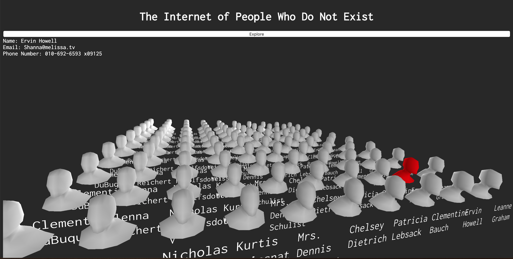

# The Internet of People Who Do Not Exist
<!-- A one sentence description of the project or assignment -->
This is a project that uses an API that generates fake user accounts.

<!-- It is good practice to add an about or summary -->
## About
This website was created created using p5.js WEBJL canvas. I created an array of 100 heads and extracted sample user data from the JSON Placeholder API. You can move around the world with your mouse (zoom in/zoom out, rotate, span). When you click the "Explore" button, a random person will be selected and their information will be displayed.

NOTE: I was orginally working with a different API that contained more test users, but I started encountering technical difficulties when accessing the attributes so I began to use this API instead. As a result, there are some repeated user profiles. I will fix this issues as soon as I can.

<!-- Any knowledge or tools you will need before hand -->
### Prerequisites

1. A text editor or Integrated Development Environment (IDE)- preferably [VS Code](https://code.visualstudio.com/) to view code on your computer if you wish to download.

<!-- any installation needs should be defined -->
<!-- Write instructions on how to start working on your project -->
<!-- Notes about the deployment -->
## Deployment

This project is hosted on Glitch. You can visit the rendered website [here](https://jlizardo019-peoplewhodontexist.glitch.me/)

### Built with

* [VS Code](https://code.visualstudio.com/)
* [Github](https://github.com)
* [Glitch](https://glitch.com)
* [JSON Placeholder API](http://jsonplaceholder.typicode.com/)

### Process

<!--  -->
1. I created and analyzed the design/asthetic for the website and what was the style I was going for.

<!--  -->
2. Next, I established the color palette for the design.

3. Using the website [GoogleFonts] (https://fonts.google.com/), I identified the font I wanted to use in my website. I ended up using the font Inconsolata Regular in my design.

<!--  -->
4. I established my wireframe before moving on to coding.

5. I created the 3D world in p5.js and added the interactive component of using the orbitControl() function to allow users to navigate the space.

6. I set up my my html and css, first working on the desktop version and then adding the additional media queries of mobile and tablet (Note: need to add my media query css files to this git).

7. I deployed the website on Glitch.

<!--For more details about the creative process of this website development, visit my [blog] (https://julielizardo.com/)-->

## License
Please reach out if you would like to fork this project or contribute to development

## Author

* [Julie Lizardo](https://www.linkedin.com/in/julie-lizardo/)  -- [Creative Engineer](https://julielizardo.com/)

<!-- thank and reference all the things that made your project happen -->
## References

* [TurboSquid](https://www.turbosquid.com/) for the 3D-model .obj file of a generic human head
* [Adobe Photoshop](https://www.adobe.com/products/photoshopfamily.html) to create style guides and wireframes